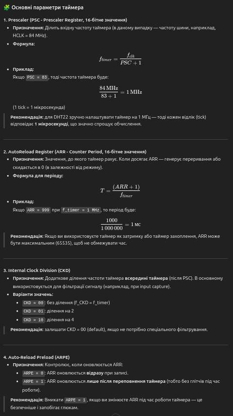

# Project preparing
1. Add 1 GPIO to the MCU for `DHT22`.
2. Enable TIMx. Setup the TIMx to the frequency 1 MHz.



## How to use:
```
#include "dht22.h"

/* Наприклад, TIM3 налаштований на 1 MHz і 0xFFFF ARR */
extern TIM_HandleTypeDef htim3;

static DHT22_t dht;
static DHT22_Data_t dht_data;

void app_init(void)
{
    GPIO_t pin = { .port = GPIOA, .pin = GPIO_PIN_1 };

    DHT22_Config_t cfg;
    dht22_default_config(&cfg);

    /* Якщо є зовнішній pull-up резистор (рекомендовано), можна вимкнути внутрішній */
    /* cfg.use_internal_pullup = 0; */

    (void)dht22_init(&dht, pin, &htim3, &cfg);
}

void app_loop(void)
{
    if (dht22_read(&dht, &dht_data) == DHT22_STATUS_OK) {
        /* dht_data.temperature_x10: 253 => 25.3C
           dht_data.humidity_x10:    615 => 61.5% */
    }

    /* DHT22 не любить часті опитування: типово роблять паузу ~2 секунди */
    HAL_Delay(2000);
}
```

